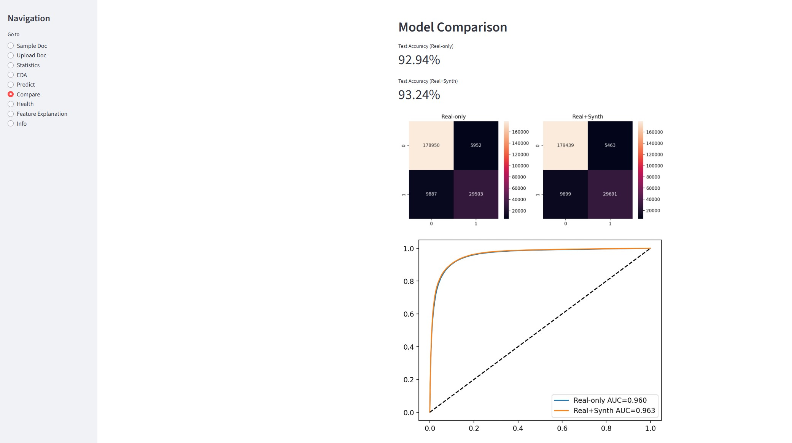

# 📌 SBA Loan Default Prediction

Predicting whether an SBA loan will default using machine learning with both real-world and synthetic data.

---

## 📝 Table of Contents

1. [About the Project](#about-the-project)
2. [Motivation](#motivation)
3. [Features](#features)
4. [Installation](#installation)
5. [Usage](#usage)
6. [Project Structure](#project-structure)
7. [Visuals](#visuals)
8. [Contributing](#contributing)
9. [Credits](#credits)
10. [License](#license)

---

## 📖 About the Project

This project applies a Random Forest classifier to predict loan default for SBA loans using historical data. It features:

* A real data model trained on SBA public loan data
* A synthetic data model trained on the same data augmented with estimated financial features
* A Streamlit dashboard for visualizing results and exploring model performance

---

## 🚀 Motivation

This project represents my growth from beginner to builder. It combines my interests in machine learning, finance, and product development into something practical and valuable. I wanted to create a solution that could help analysts and lenders better understand borrower risk, while also continuing to improve my own technical and communication skills in the process.

Whether you're a researcher, an aspiring quant, or just curious about data-driven decision making, I hope this project offers insight and value.

---

## 🌟 Features

Dynamically adjust individual loan features (e.g., credit score, interest rate, number of employees) within the dashboard and receive updated default probability predictions in real time

Simulate realistic loan applications and financial statements by generating synthetic 'fake' documents for testing

Integrate an OCR (Optical Character Recognition) pipeline to extract structured data from uploaded documents and images, feeding that data into the model to estimate default probability

Clean and transform raw SBA loan data using robust preprocessing techniques

Engineer synthetic borrower features such as Credit Score, DSCR, Interest Rate (non-public estimates)

Train and evaluate machine learning models using classification metrics (accuracy, precision, recall, F1-score)

Compare model performance across real vs. synthetic data feature sets

Generate interpretable model insights using feature importance rankings

Explore predictions and performance in an interactive Streamlit dashboard (no image dependencies)

---

## ⚙️ Installation

1. Clone the repository:
   ```bash
   git clone https://github.com/your-username/sba-loan-predictor.git
   cd sba-loan-predictor
   ```

2. Create and activate a virtual environment:

   ```bash
   python -m venv .venv
   .venv\Scripts\activate        # On Windows
   source .venv/bin/activate 
   ```

3. Manually install required packages:

   ```bash
   pip install streamlit pandas numpy scikit-learn matplotlib seaborn PyMuPDF pillow joblib openpyxl shap
   ```

4. Train the Model
    ```bash
   python src/train_model.py
    ```
6. Run the dashboard:

   ```bash
   streamlit run app.py
   ```

---

##  Usage

Once launched, the dashboard allows users to:

Toggle between models (real vs. synthetic features)

View feature importances with interactive visualizations

Compare evaluation metrics such as accuracy, precision, recall, F1-score, ROC AUC, and calibration curves

Upload loan application documents or images for OCR extraction and default probability prediction

Adjust any loan feature (e.g., interest rate, DSCR, number of employees) in real time to see updated default probabilities

Explore and interpret the drivers behind SBA loan defaults through clear, data-driven insights

---

## 🗂 Project Structure

```
LoanDefaultPredictionModel/
├── .venv/                  # Virtual environment
├── dashboard.py            # Streamlit dashboard application
├── Train_model.py          # Model training script
├── .gitignore              # Git ignore rules
├── LICENSE                 # License information
├── README.md               # Project documentation
└── pyvenv.cfg               # Virtual environment configuration
```

---

## 🖼 Visuals



> Dashboard showing model comparison and feature importances

---


##  Model Performance

After preprocessing and training on the SBA loan dataset (897,167 samples), the models achieved the following results:

Real Features Model (13 columns)

Train Accuracy: 99.61%

Test Accuracy: 92.94%

AUC-ROC: 0.960

Brier Score: Not measured

False Positives (FP): 5,952

False Negatives (FN): 9,887

Real + Synthetic Features Model (17 columns)

Train Accuracy: 100.00%

Test Accuracy: 93.24%

AUC-ROC: 0.963

Brier Score: 0.05195

False Positives (FP): 5,463

False Negatives (FN): 9,699

Saved Models

loan_model_real.pkl — Trained with real features only

loan_model_synth.pkl — Trained with both real and synthetic features

Performance Insights

Synthetic features provided a modest improvement in both test accuracy and AUC-ROC.

The Real+Synthetic model demonstrated strong calibration, as indicated by the low Brier score.

Both models achieved high AUC-ROC values, indicating excellent discriminatory ability.

Lower FP and FN counts in the Real+Synthetic model suggest better generalization.
---

## 📄 License

This project is licensed under the **MIT License**. See the `LICENSE` file for more details.

---

## 🏷️ Badges


